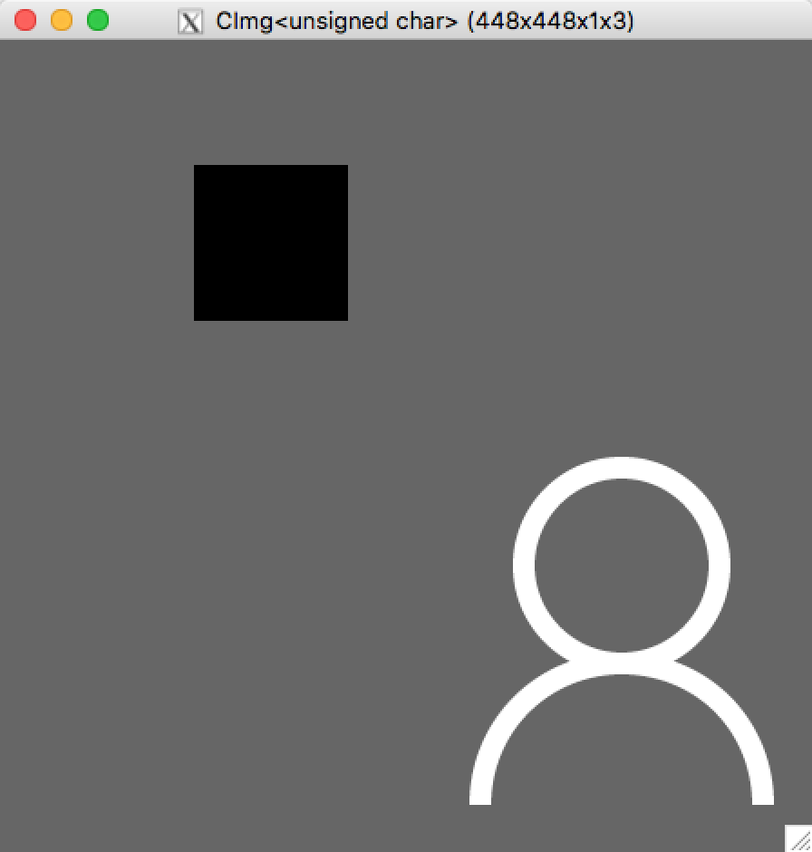
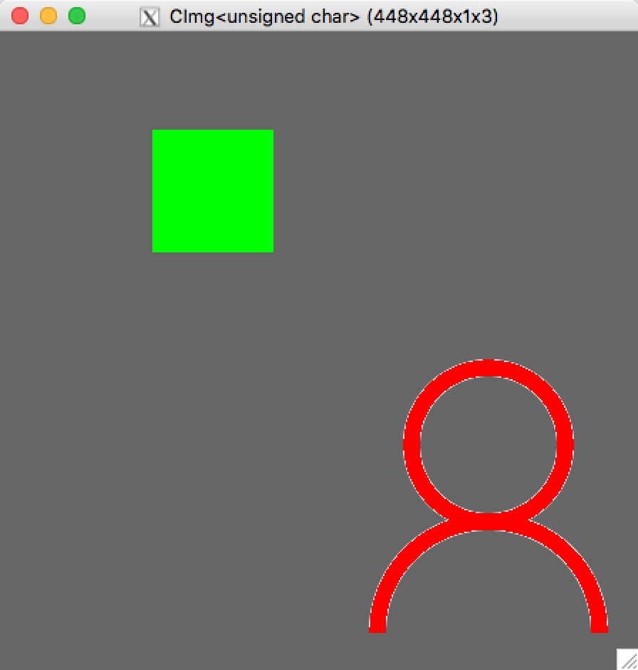
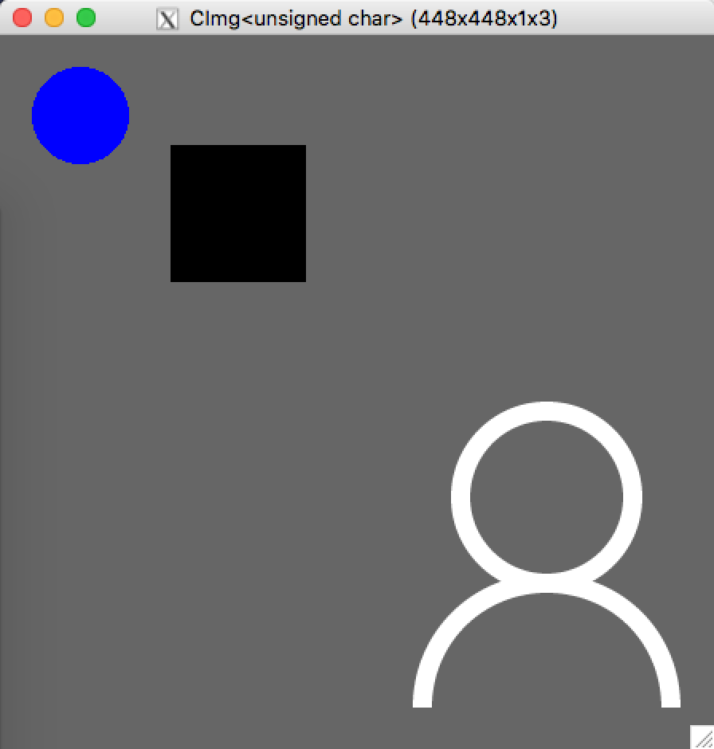
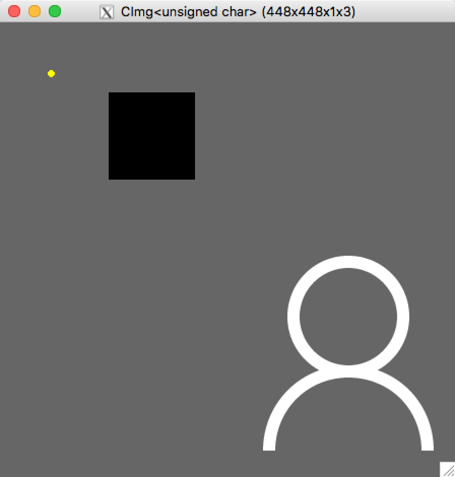

# Ex1: 图像读取和显示以及像素操作

## 输入图像

  + 开发环境：macOS
  + 编译（在 ex1/ 目录下执行）：`g++ -o bin/task# src/task#.cpp -O2 -lm -lpthread -I/usr/X11R6/include -L/usr/X11R6/lib -lm -lpthread -lX11`
  + 运行（在 ex1/ 目录下执行）：`bin/task#`

  PS：将命令中的 # 替换成对应任务的数字编号，如第一个任务就是 task1。

  1. 读取 1.bmp 文件，并用 CImg.display() 显示

  

  2. 把1.bmp文件的白色区域变成红色，黑色区域变成绿色

  

  3. 在图上绘制一个圆形区域，圆心坐标(50,50)，半径为30，填充颜色为蓝色。

  

  4. 在图上绘制一个圆形区域，圆心坐标(50,50)，半径为3，填充颜色为黄色。

  

## 思考

  1. 为什么第四步绘制的圆形区域形状效果不好。

  因为第四步绘制圆的半径太短，映射到图像中的像素点的时候，圆的边缘会出现比较明显的锯齿现象。