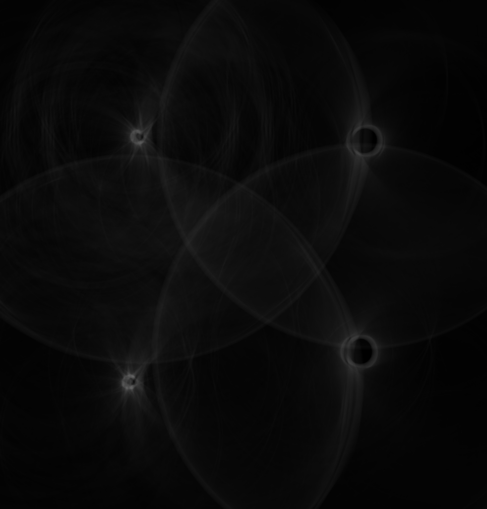

# 测试报告

## Task 1

检测直线用的是霍夫变换的方法（霍夫空间中的横轴表示角度，纵轴表示距离），其中涉及到了三个参数：
  1. GRADLIMIT。这是梯度的阈值，若算出的梯度大小小于 RADLIMIT，则不做考虑。
  2. THRESHOLD。这个参数在霍夫空中寻找峰点的阈值，只有累积了 THRESHOLD 次，才认为是峰点，也就是找到了一条直线。
  3. DIFF。这个参数是在找到一个峰点之后，以 DIFF 为范围搜索是否有其他的峰点，若有则取较大的。

经历了漫长的调参阶段之后，找到了一组比较合适的方案：

```C++
#define GRADLIMIT  15
#define THRESHOLD  800
#define DIFF       90
```

利用上面的这组参数，对于给定的图片（有一些参数做了微调），检测到的直线以及焦点如下：（为了方便我重新命名为 1.jpg ~ 6.jpg）

### 1.jpg

lines:
  + y = 0.0349208x + 251.153
  + y = -19.0811x + 5388.26
  + y = 57.29x + -138835
  + y = -6.12323e-17x + 3461

intersections:
  + (268.733, 260.537)
  + (2429.23, 335.984)
  + (101.004, 3461)
  + (2483.78, 3461)


### 2.jpg

lines:
  + y = 0.404026x + 381.801
  + y = -2.90421x + 3013.19
  + y = 0.344328x + 2154.37
  + y = -2.74748x + 9405.88

intersections:
  + (795.406, 703.166)
  + (2863.42, 1538.7)
  + (264.371, 2245.4)
  + (2345.4, 2961.96)


### 3.jpg

lines:
  + y = 0.0349208x + 509.31
  + y = 57.29x + -35697.1
  + y = -28.6363x + 83038.4
  + y = -0.0524078x + 3741.13

intersections:
  + (632.37, 531.393)
  + (2878.47, 609.829)
  + (687.767, 3705.08)
  + (2774.2, 3595.74)


### 4.jpg

lines:
  + y = 0.600861x + 377.989
  + y = -1.73205x + 2778
  + y = 0.487733x + 2560.1
  + y = -1.96261x + 8163.17

intersections:
  + (1028.76, 996.132)
  + (3036.97, 2202.78)
  + (98.1641, 2607.97)
  + (2286.65, 3675.37)


### 5.jpg

lines:
  + y = 57.29x + -35983.6
  + y = 0.0699268x + 748.824
  + y = -28.6363x + 75330.6
  + y = -0.0699268x + 3689.99

intersections:
  + (641.95, 793.714)
  + (691.66, 3641.62)
  + (2598.11, 930.502)
  + (2507.87, 3514.62)


### 6.jpg

lines:
  + y = 0.0874887x + 538.047
  + y = -28.6363x + 22579.1
  + y = -19.0811x + 53691.6
  + y = -0.0174551x + 3568.54

intersections:
  + (767.347, 605.182)
  + (2772.94, 780.649)
  + (664.269, 3556.95)
  + (2629.24, 3522.65)


> 结果图片保存在：img/result1 目录下，#_edge.jpg 为检测的边缘，#_result.jpg 为检测的结果

### 测试新图片

除了作业给定的图片之后，我自己随便拍了两张 A4 纸的图像，检测结果如下：


## Task 2

时间的关系，没来得及做完，只做到了 hough 图像，所以这里只讲一下思路：

1. 先做边缘检测，检测到梯度大于某个阈值时，进行霍夫变换。即将 (x - a)^2 + (y - b)^2 = r^2 中的 a, b 映射到霍夫空间（这里先假设 r 为某个固定值，比如 100）。
2. 找到霍夫空间中的亮点，即为圆心。
3. 找到圆心之后，扫描原图的边缘点，将其与圆心的距离做一个统计，取出峰值处即为所求的半径。

现在只做了第一步，下面贴上 6 张图片的霍夫空间图像：





