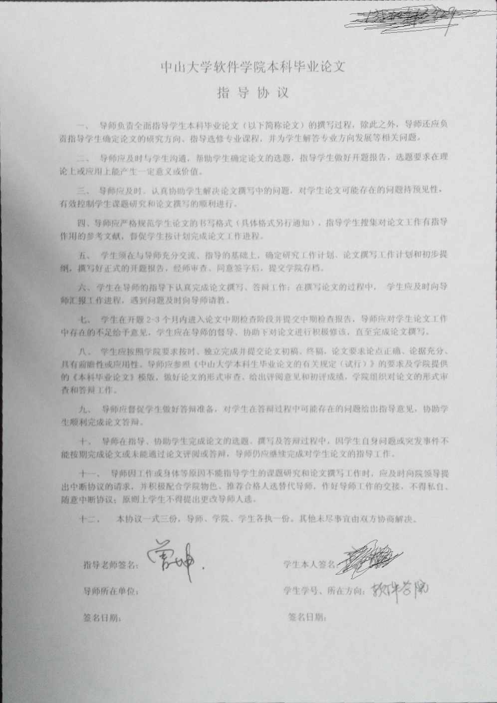

# 测试报告

## Task 1

这个任务主要是在 Ex3 Task1 的基础上（找到 A4 纸四个顶点之后），加上 Projective Transform。

### 找边缘直线

首先，这次的代码我优化了找 A4 纸边缘直线的算法：

之前是通过一组比较严格的参数勉强找到 A4 纸的四条直线，但是这组参数可能对其他的图片不太友好（过拟合）。因此这次降低了找直线的阈值，而是在检测到的 Hough 空间中的多条直线中，选取票数最高的 4 条直线。这样一来，只要输入图片的噪声不要太多，就能正确检测到 A4 纸的四条边。

### 确定顶点

在找到四个点之后，还需要确定哪个点是目标 A4 的左上角/右上角/左下角/右下角顶点。我的做法是这样，在上一步找到到四条直线的四个顶点中（w 是图片的宽，h 是图片的高）：

+ 取最接近 (0, 0) 的交点为左上角点
+ 取最接近 (w, 0) 的交点为右上角点
+ 取最接近 (0, h) 的交点为左下角点
+ 取最接近 (w, h) 的交点为右下角点

BTW，有一种情况需要注意，比如下面的这张图片，最接近 (0, 0) 的点其实不是目标 A4 纸的左上角，因为这张图片中 A4 只是偏向于横放的，所以这里还要做一个判断处理。

### 计算转换矩阵

投影转换（Projective Transform）的原理如下：

其中，(x, y) -> (u, v) 是变换前后的位置映射。因此下一步应该是将中间的矩阵计算出来，也就是求出 a~h 总共 8 个参数。

目前，我们已经找到了原图的四个 A4 纸顶点的坐标：(x0, y0), (x1, y1), (x2, y2), (x3, y3)，我们也知道了目标图像中对应的四个顶点的坐标：(0, 0), (m, 0), (0, n), (m, n)。其中，m, n 分别是输出 A4 图像的宽和高。

因此，4 组位置关系，可以列出 8 个线性方程，也就是下面的矩阵：

上面的这个方程组的求解，用 Eigen 库的 LU 可以很快很稳定地解出来。

### 测试结果

## Task 2

时间关系，没来得及做。
