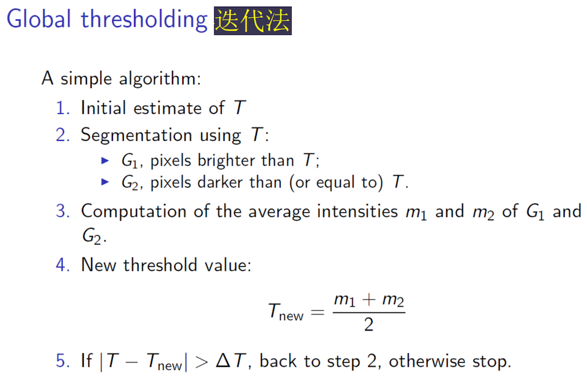
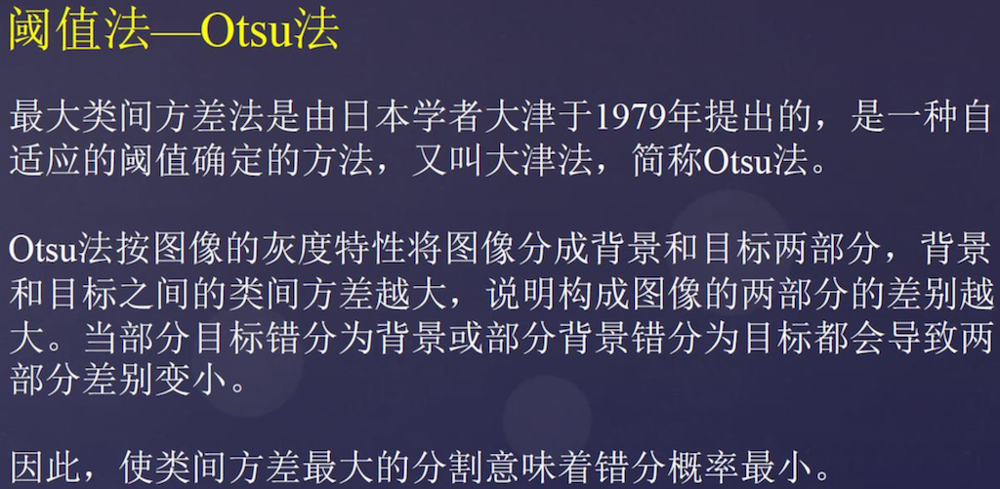

# Ex5

## 1. 用手机拍摄100张不同的A4纸的图像(以压缩包的形式提交)。

> 拍摄要求: 要求得到与前面A4纸矫正中用的图像类似， A4纸上尽量只包含手写/印刷体的数字或者英文字母（图像中A4纸最多占图像大小的1/2，即图像中需要一部分背景）。

图像存放在 `img/dataset/origin` 目录下。

## 2. 简要描述“迭代法”和“OSTU”这两个方法的区别。





迭代法的思想很像数据挖掘中的 K-Means 算法，不断地迭代更新灰度阈值。但是如果迭代的次数太多的话（极端情况下），这个算法的结果会是：灰度阈值不断逼近某一方。意识就是说，假设一张图片的前景点比较多，用迭代法，进行适当次数的迭代之后，前景背景的分割效果还可以。但是一旦做太多次迭代，就会是很多背景点也被划分为前景点。

我对 Otsu 法的理解，则是它换了一个角度来寻找最佳灰度阈值。迭代法是不断迭代，直接寻找最佳灰度。而 Otsu 则是转了个弯，通过类间方差来反映前后景分割效果。这样就可以遍历来找到最大类间方差————也就是找到了最佳灰度阈值。

另外一个比较大的区别就是：**Otsu 慢很多......**

## 3. 尝试用C++(只用CImg图像库)编程实现“迭代法”和“OSTU”

> 这两个图像分割方法(要求把每个方法都各自封装成类)。 然后对自己拍摄的100张图像做图像分割处理, 以验证算法的正确性, 并给出性能分析(包括准确性和时间复杂度)。在实验报告中给出实验部分实验结果(10个最好的结果和10个最差的结果), 并分析结果好坏的原因。

参考 `src/ImageSegementer.cpp` 中的实现：

+ `applyGlobalThresholding`
+ `applyOtsu`

编译、运行（在 ex5 目录下）：

```sh
# macOS 环境下，若是其他系统请换成对应的 CImg 编译命令
g++ -o bin/task src/ImageSegementer.cpp src/task.cpp -O2 -lm -lpthread -I /usr/X11R6/include -L /usr/X11R6/lib -lm -lpthread -lX11bin/task1

bin/task
```

