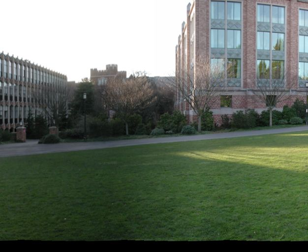
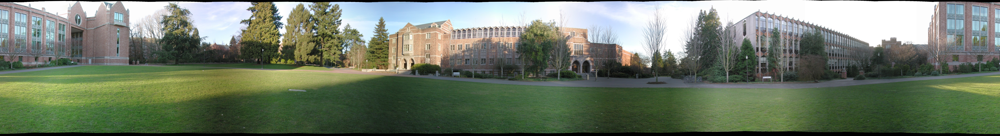

# Panorama Image Stitching

1. Take pictures on a tripod (or handheld)
2. Warp images to spherical coordinates
3. Extract features
4. Align neighboring pairs using RANSAC
5. Write out list of neighboring translations
6. Correct for drift
7. Read in warped images and blend them 8. Crop the result and import into a viewer

> [Computer Vision (CSE576) UW](http://www.cs.washington.edu/education/courses/cse576/08sp/projects/project2/project2.html)

## Usage

我的开发环境是在 macOS，需要提前安装好 [fltk](http://www.fltk.org/software.php)：

```sh
brew install fltk
```

编译：

```sh
make
```

测试（需要先将原始图片转为 tga 格式）：

```sh
sh test1.sh    # 拼接 08 ~ 11
sh test2.sh    # 拼接 08 ~ 25
```

## TODO

第一步的拍摄照片可以忽略，直接使用作业数据集中的两组照片即可。

从 Computer Vision (CSE576) UW 中下载的 PanoramaSkeleton.zip 算法骨架，有一些核心函数需要自己实现：

另外，需要实现 Panorama 没有包括的特征计算算法

## 我的工作

### 1. 重构 Panorama

重构之后的工程结构为（未合并 Features 部分）：

+ ImageLib
  + include
  + obj
  + src
  + lib
+ include
+ src
  + BlendImages.cpp
  + FeatureAlign.cpp
  + FeatureSet.cpp
  + WarpSpherical.cpp
  + Panorama.cpp
+ obj
+ bin
  + Panoramas
+ Makefile

### 2. 实现 Panorama 中的核心算法

> 参考课件：[Stitching.pdf](Stitching.pdf) 

这部分需要自己实现 6 个函数，我在项目网站找到该课件，并根据课件内容实现了下面的函数。

1. WarpSphericalField

```C++
CFloatImage WarpSphericalField(CShape srcSh, CShape dstSh, float f,
                                 float k1, float k2, const CTransform3x3 &r)
{
  // Set up the pixel coordinate image
  dstSh.nBands = 2;
  CFloatImage uvImg(dstSh);   // (u,v) coordinates

  // Fill in the values
  for (int y = 0; y < dstSh.height; y++) {
    float *uv = &uvImg.Pixel(0, y, 0);
    for (int x = 0; x < dstSh.width; x++, uv += 2) {
      float xf = (x - 0.5f*dstSh.width ) / f;
      float yf = (y - 0.5f*dstSh.height) / f;
      float xt, yt, zt;
      CVector3 p;

      // *** BEGIN TODO ***

      //convert the theta and phi to spherical coordinates 
      p[0] = sin(xf)*cos(yf);
      p[1] = sinf(yf);
      p[2] = cos(xf)*cos(yf);

      //p = r*p; //p now holds the rotated spherical coordinates ?

      //normalize all the coordinates by z_hat
      xt = p[0] / p[2];
      yt = p[1] / p[2];
      zt = 1;

      //apply radial distortion
      float r_squared = xt * xt + yt * yt;
      xt = xt * (1 + k1 * r_squared + k2 * r_squared*r_squared);
      yt = yt * (1 + k1 * r_squared + k2 * r_squared*r_squared);

      // *** END TODO ***

      // Convert back to regular pixel coordinates and store
      float xn = 0.5f*srcSh.width  + xt*f;
      float yn = 0.5f*srcSh.height + yt*f;
      uv[0] = xn;
      uv[1] = yn;
    }
  }
  return uvImg;
}
```

2. alignPair

```C++
int alignPair(const FeatureSet &f1, const FeatureSet &f2,
              const vector<FeatureMatch> &matches, MotionModel m, float f,
              int nRANSAC, double RANSACthresh, CTransform3x3& M)
{
  // BEGIN TODO
  // write this entire method

	int bestIndex;   // holds index of match with most inclusive translation
	int testIndex;	 // holds current index being tested for number of inliers
	vector<int> bestIndexAssociatedInliers; //the indices of matches that follow the same translation as the bestIndex
	int bestInlierCount = 0; //number of inliers in bestIndexAssociatedInliers

	FeatureMatch match;
	int xTrans, yTrans;
	Feature feature1, feature2;
	CTransform3x3 transMatrix;

	for (int i = 0; i < nRANSAC; i++) {

		testIndex = rand() % matches.size(); // provides a random index between 0 and the size of matches	

		feature1 = f1[matches[testIndex].id1 - 1];
		feature2 = f2[matches[testIndex].id2 - 1];

		xTrans = feature2.x - feature1.x;
		yTrans = feature2.y - feature1.y;

		transMatrix = CTransform3x3::Translation((float)xTrans, (float)yTrans);

		vector<int> inliers;
		int count = countInliers(f1, f2, matches, m, f, transMatrix, RANSACthresh, inliers);

		if (count > bestInlierCount) {
			bestIndex = i;
			bestInlierCount = count;
			bestIndexAssociatedInliers = inliers;
			M = transMatrix;
		}

	}

	leastSquaresFit(f1, f2, matches, m, f, bestIndexAssociatedInliers, M);

  // END TODO

  return 0;
}
```

3. countInliers

```C++
int countInliers(const FeatureSet &f1, const FeatureSet &f2,
                 const vector<FeatureMatch> &matches, MotionModel m, float f,
                 CTransform3x3 M, double RANSACthresh, vector<int> &inliers)
{
  inliers.clear();
  int count = 0;
  for (unsigned int i=0; i<(int) matches.size(); i++) {
    // BEGIN TODO

    CVector3 feat1Vec = CVector3();
    Feature testF1 = f1[matches[i].id1 - 1];
    Feature testF2 = f2[matches[i].id2 - 1];

    feat1Vec[0] = testF1.x;
    feat1Vec[1] = testF1.y;
    feat1Vec[2] = 1;

    CVector3 translatedF1 = M * feat1Vec;
    float dx = testF2.x - translatedF1[0];
    float dy = testF2.y - translatedF1[1];
    float distError = sqrt(dx*dx + dy * dy);
    if (distError <= RANSACthresh) {
      inliers.push_back(i);
      count++;
    }

    // END TODO
  }
  return count;
}
```

4. leastSquaresFit

```C++
int leastSquaresFit(const FeatureSet &f1, const FeatureSet &f2,
                    const vector<FeatureMatch> &matches, MotionModel m, float f,
                    const vector<int> &inliers, CTransform3x3& M)
{
  double u = 0;
  double v = 0;

  for (int i=0; i<inliers.size(); i++) {
    double xTrans, yTrans;

    // BEGIN TODO
    // compute the translation implied by the ith inlier match
    // and store it in (xTrans,yTrans)

		Feature testF1 = f1[matches[inliers[i]].id1 - 1];
		Feature testF2 = f2[matches[inliers[i]].id2 - 1];

		xTrans = testF2.x - testF1.x;
		yTrans = testF2.y - testF1.y;

    // END TODO

    u += xTrans;
    v += yTrans;
  }

  u /= inliers.size();
  v /= inliers.size();

  M[0][0] = 1;
  M[0][1] = 0;
  M[0][2] = u;
  M[1][0] = 0;
  M[1][1] = 1;
  M[1][2] = v;
  M[2][0] = 0;
  M[2][1] = 0;
  M[2][2] = 1;

  return 0;
}
```

5. BlendImages

```C++
CByteImage BlendImages(CImagePositionV& ipv, float blendWidth)
{
  // Assume all the images are of the same shape (for now)
  CByteImage& img0 = ipv[0].img;
  CShape sh        = img0.Shape();
  int width        = sh.width;
  int height       = sh.height;
  int nBands       = sh.nBands;
  int dim[2]       = {width, height};

  // Compute the bounding box for the mosaic
  int n = ipv.size();
  float min_x = 0, min_y = 0;
  float max_x = 0, max_y = 0;
  int i;
  for (i = 0; i < n; i++) {
		
		CTransform3x3 &pos = ipv[i].position;

    CVector3 corners[4];

    corners[0][0] = 0.0;
    corners[0][1] = 0.0;
    corners[0][2] = 1.0;

    corners[1][0] = width - 1;
    corners[1][1] = 0.0;
    corners[1][2] = 1.0;

    corners[2][0] = 0.0;
    corners[2][1] = height - 1;
    corners[2][2] = 1.0;

    corners[3][0] = width - 1;
    corners[3][1] = height - 1;
    corners[3][2] = 1.0;

    corners[0] = pos * corners[0];
    corners[1] = pos * corners[1];
    corners[2] = pos * corners[2];
    corners[3] = pos * corners[3];

    corners[0][0] /= corners[0][2];
    corners[0][1] /= corners[0][2];

    corners[1][0] /= corners[0][2];
    corners[1][1] /= corners[0][2];

    corners[2][0] /= corners[0][2];
    corners[2][1] /= corners[0][2];

    corners[3][0] /= corners[0][2];
    corners[3][1] /= corners[0][2];
        
		// *** BEGIN TODO #1 ***
		// add some code here to update min_x, ..., max_y

		//check the corners to see if an x or y is smaller/larger than the running min/max and update the running version if so.
		min_x = (float)MIN(min_x, corners[0][0]);
		min_x = (float)MIN(min_x, corners[1][0]);
		min_x = (float)MIN(min_x, corners[2][0]);
		min_x = (float)MIN(min_x, corners[3][0]);

		min_y = (float)MIN(min_y, corners[0][1]);
		min_y = (float)MIN(min_y, corners[1][1]);
		min_y = (float)MIN(min_y, corners[2][1]);
		min_y = (float)MIN(min_y, corners[3][1]);

		max_x = (float)MAX(max_x, corners[0][0]);
		max_x = (float)MAX(max_x, corners[1][0]);
		max_x = (float)MAX(max_x, corners[2][0]);
		max_x = (float)MAX(max_x, corners[3][0]);

		max_y = (float)MAX(max_y, corners[0][1]);
		max_y = (float)MAX(max_y, corners[1][1]);
		max_y = (float)MAX(max_y, corners[2][1]);
		max_y = (float)MAX(max_y, corners[3][1]);

		// *** END TODO #1 ***
  }

  // Create a floating point accumulation image
  CShape mShape((int)(ceil(max_x) - floor(min_x)),
                (int)(ceil(max_y) - floor(min_y)), nBands);
  CFloatImage accumulator(mShape);
  accumulator.ClearPixels();

	double x_init, x_final;
  double y_init, y_final;

	// Add in all of the images
  for (i = 0; i < n; i++) {
    CTransform3x3 &M = ipv[i].position;
    CTransform3x3 M_t = CTransform3x3::Translation(-min_x, -min_y) * M;
    CByteImage& img = ipv[i].img;

    // Perform the accumulation
    AccumulateBlend(img, accumulator, M_t, blendWidth);

    if (i == 0) {
      CVector3 p;
      p[0] = 0.5 * width;
      p[1] = 0.0;
      p[2] = 1.0;

      p = M_t * p;
      x_init = p[0];
      y_init = p[1];
    } else if (i == n - 1) {
      CVector3 p;
      p[0] = 0.5 * width;
      p[1] = 0.0;
      p[2] = 1.0;

      p = M_t * p;
      x_final = p[0];
      y_final = p[1];
    }
  }

  // Normalize the results
  CByteImage compImage(mShape);
  NormalizeBlend(accumulator, compImage);
  bool debug_comp = false;
  if (debug_comp)
    WriteFile(compImage, "tmp_comp.tga");

  // Allocate the final image shape
  CShape cShape(mShape.width - width, height, nBands);
  CByteImage croppedImage(cShape);

  // Compute the affine deformation
  CTransform3x3 A;
  
  // *** BEGIN TODO #2 ***
  // fill in the right entries in A to trim the left edge and
  // to take out the vertical drift

  A[1][0] = -(min_y - max_y + height) / (max_x - min_x);  //shear

  // *** END TODO #2 ***

  // Warp and crop the composite
  WarpGlobal(compImage, croppedImage, A, eWarpInterpLinear);

  return croppedImage;
}
```

6. NormalizeBlend

```C++
static void NormalizeBlend(CFloatImage& acc, CByteImage& img)
{
	// *** BEGIN TODO ***
	// fill in this routine..
	
	int height = acc.Shape().height;
	int width = acc.Shape().width;
	for (int x = 0; x < width; x++)
	{
		for (int y = 0; y < height; y++) {
			img.Pixel(x, y, 0) = acc.Pixel(x, y, 0) / acc.Pixel(x, y, 3);
			img.Pixel(x, y, 1) = acc.Pixel(x, y, 1) / acc.Pixel(x, y, 3);
			img.Pixel(x, y, 2) = acc.Pixel(x, y, 2) / acc.Pixel(x, y, 3);
			//assume Pixel(x,y,3) is defaulted to one
		}
	}

	// *** END TODO ***
}
```

### 3. 实现 Panorama 之外的特征提取算法

将特则提取算法 Features 合并入 Panorama 之后，最终的工程结构为：

+ ImageLib
  + include
  + obj
  + src
  + lib
+ include
+ src
  + BlendImages.cpp
  + FeatureAlign.cpp
  + FeatureSet.cpp
  + WarpSpherical.cpp
  + Panorama.cpp
  + **Features.cpp**
  + **FeaturesMain.cpp**
  + **ImageDatabase.cpp**
  + **ImageView.cpp**
+ obj
+ bin
  + **Features**
  + Panoramas
+ Makefile

1. 特征特征提取算法：

```C++
// TODO: Write this function to perform ratio feature matching.  
// This just uses the ratio of the SSD distance of the two best matches
// and matches a feature in the first image with the closest feature in the second image.
// It can match multiple features in the first image to the same feature in
// the second image.  (See class notes for more information)
void ratioMatchFeatures(const FeatureSet &f1, const FeatureSet &f2, vector<FeatureMatch> &matches, double &totalScore) 
{
  int m = f1.size();
	int n = f2.size();

	matches.resize(m);
	totalScore = 0;

	double d;
	double dBest, dSecondBest;
	int idBest;

	for (int i = 0; i < m; i++) {
		dBest = 1e100;
		idBest = 0;

		for (int j = 0; j < n; j++)
		{
			d = distanceSSD(f1[i].data, f2[j].data);

			if (d < dBest)
			{
				dSecondBest = dBest;
				dBest = d;
				idBest = f2[j].id;
			}
		}

		matches[i].id1 = f1[i].id;
		matches[i].id2 = idBest;
		matches[i].score = dBest / dSecondBest;
		totalScore += matches[i].score;
	}
}
```

2. 特征匹配算法：

```C++
// TODO: Write this function to perform ratio feature matching.  
// This just uses the ratio of the SSD distance of the two best matches
// and matches a feature in the first image with the closest feature in the second image.
// It can match multiple features in the first image to the same feature in
// the second image.  (See class notes for more information)
void ratioMatchFeatures(const FeatureSet &f1, const FeatureSet &f2, vector<FeatureMatch> &matches, double &totalScore) 
{
  int m = f1.size();
	int n = f2.size();

	matches.resize(m);
	totalScore = 0;

	double d;
	double dBest, dSecondBest;
	int idBest;

	for (int i = 0; i < m; i++) {
		dBest = 1e100;
		idBest = 0;

		for (int j = 0; j < n; j++)
		{
			d = distanceSSD(f1[i].data, f2[j].data);

			if (d < dBest)
			{
				dSecondBest = dBest;
				dBest = d;
				idBest = f2[j].id;
			}
		}

		matches[i].id1 = f1[i].id;
		matches[i].id2 = idBest;
		matches[i].score = dBest / dSecondBest;
		totalScore += matches[i].score;
	}
}
```

3. SIFT 特征匹配算法（这里需要配合 SIFT 特征提取算法）：

```C++
// Match the features of one image to another, the output file matches to a file
int mainMatchSIFTFeatures(int argc, char **argv) {
	if ((argc < 6) || (argc > 7)) {
		printf("usage: %s matchFeatures featurefile1 featurefile2 threshold matchfile [matchtype]\n", argv[0]);
		return -1;
	}

	// Use match type 1 as default.
	int type = 1;

	if (argc > 6) {
		type = atoi(argv[6]);
	}

	FeatureSet f1;
	FeatureSet f2;

	if (!f1.load_sift(argv[2])) {
		printf("couldn't load feature file %s\n", argv[2]);
		return -1;
	}

	if (!f2.load_sift(argv[3])) {
		printf("couldn't load feature file %s\n", argv[3]);
		return -1;
	}

  double threshold = atof(argv[4]);
  printf("the threshold is %f\n", threshold);

	vector<FeatureMatch> matches;
	double totalScore;

	// Compute the match.
	if (!matchFeatures(f1, f2, matches, totalScore, type)) {
		printf("matching failed, probably due to invalid match type\n");
		return -1;
	}

  // Output the matches 
  const char *matchFile = argv[5];
  FILE *f = fopen(matchFile, "w");
  printf("writing matching result to %s\n", matchFile);

  // Count number of matches

  int num_matches = matches.size();
  int num_good_matches = 0;
  for (int i = 0; i < num_matches; i++) {
    if (matches[i].score < threshold) {
      num_good_matches++;
    }
  }

  fprintf(f, "%d\n", num_good_matches);
  for (int i = 0; i < num_matches; i++) {
    if (matches[i].score < threshold) {
      fprintf(f, "%d %d %lf\n", matches[i].id1, matches[i].id2, matches[i].score);
    }
  }

  fclose(f);

	return 0;
}
```

## 实验结果

+ 中间产生的图片、特征文件、匹配文件可以在 `data/test*/` 中
+ 拼接的结果图片在 `data/result` 中（需要自己把结果 .tga 文件转为常见的图片格式如 jpg）




